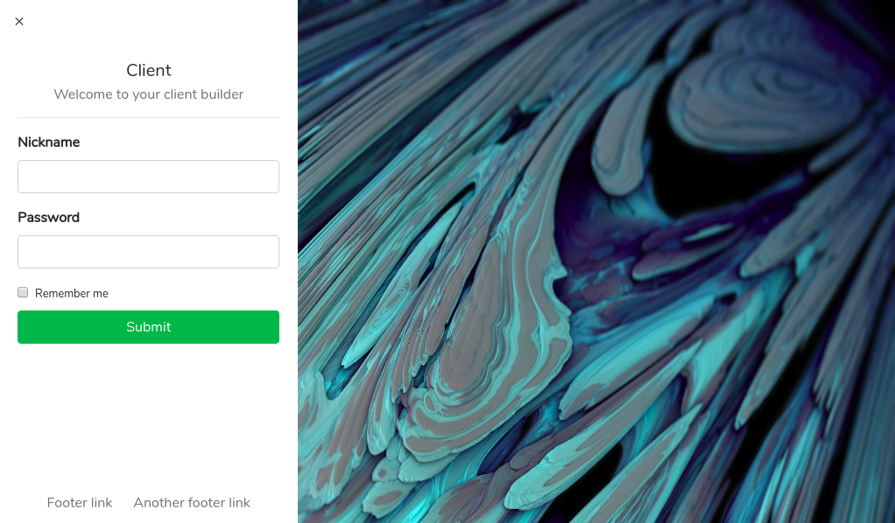

# Ex
> Just another electron application, this one is just an template of client (or may it will be an real client).



Image: [Calder Moore](https://www.artstation.com/artwork/OydDk)

## Installation

It's to hard, please make sure you know what are you doing:

1. Clone the project
2. Run:
```sh
  npm install
  npm start
```

## Usage example

It is an client, you can do whatever you wanna do with this. By the way, there's nothing especial (yet) in this, since it's just some visual thing, so, feel free to connect it with Socket.io, Laravel or any other framework.

## Release History

* 0.0.1
    * It's a baby

## Meta

Distributed under the MIT license. See ``LICENSE`` for more information.

[https://github.com/caiodomingues](https://github.com/caiodomingues)

## Contributing

1. Fork it (<https://github.com/caiodomingues/ex/fork>)
2. Create your feature branch (`git checkout -b feature/fooBar`)
3. Commit your changes (`git commit -am 'Add some fooBar'`)
4. Push to the branch (`git push origin feature/fooBar`)
5. Create a new Pull Request
